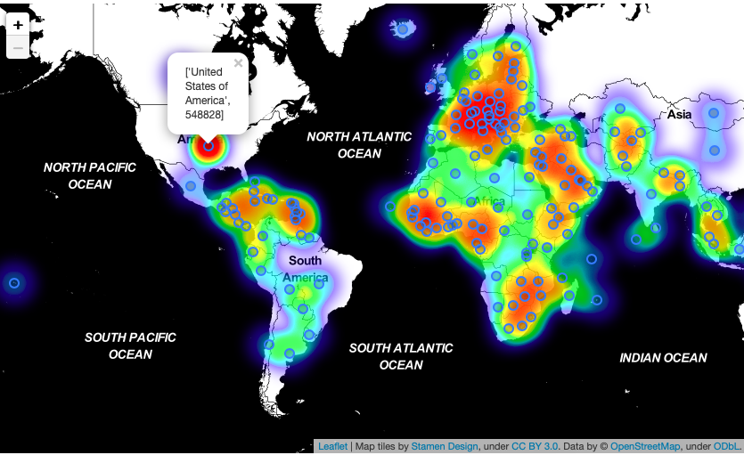
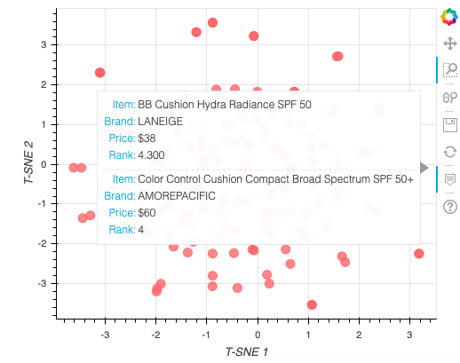
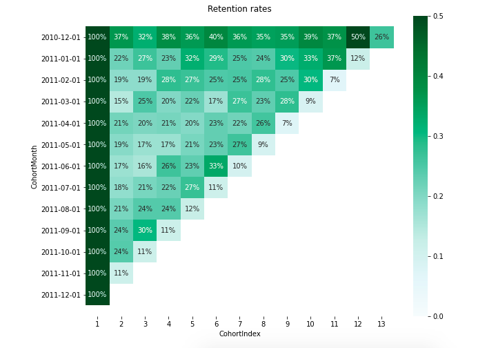

# Project Portfolio
Xinyi's data science project portfolio

## Visualization
+ [Covid Map Visualization](https://github.com/xxionias/covidmap.git)  
Generate a heatmap and a choropleth map using **Folium** via accessing the covid data API

## Recommendation System
+ [Cosmetics Ingredients](https://github.com/xxionias/CosmeticsIngredients.git)   
Create a content-based recommendation system where the 'content' will be the chemical components of cosmetics. Process ingredient lists for 1472 cosmetics on Sephora via word embedding, then visualize ingredient similarity using a machine learning method, **t-SNE** and an interactive visualization library, **Bokeh**.

## Anomaly Detection

## [Customer Segmentation](https://github.com/xxionias/CustomerSegmentation.git)
1. Cohort Analysis and visualization
2. RFM segmentation
3. Data pre-processing for k-means
4. Customer Segmentation with k-means
+ Evaluating number of clusters
+ Reviewing and visualizaing segmentation solutions

